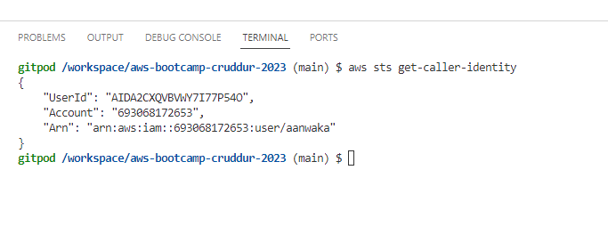
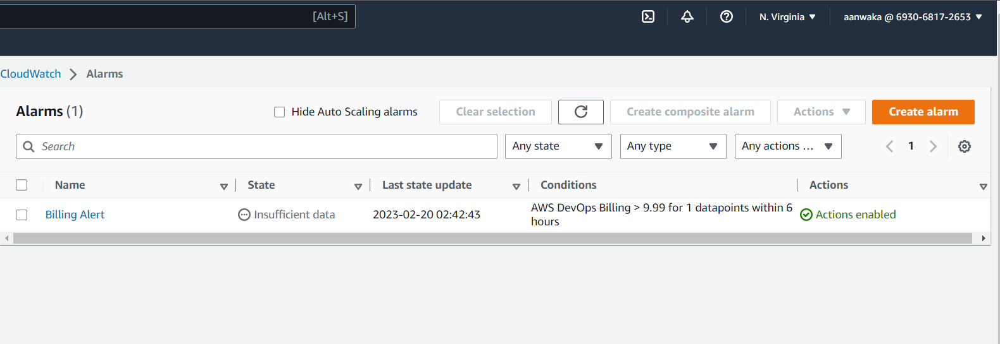
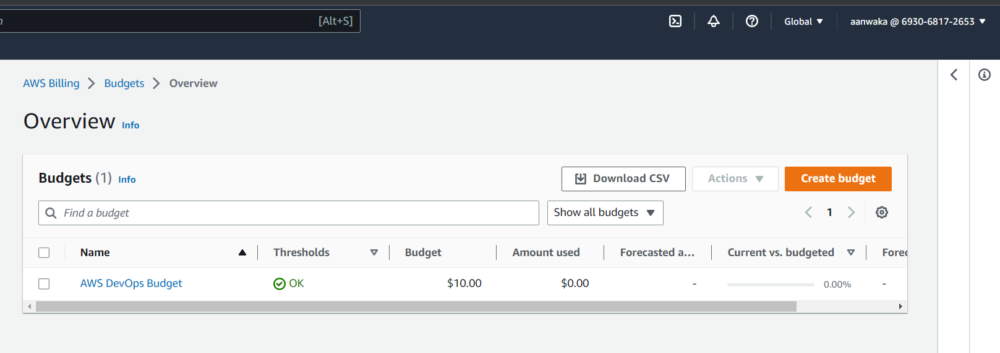

# Week 0 — Billing and Architecture

## Required Home Work

### Step 1: Conceptual Diagram on Lucid Chart

I have set up the conceptual diagram on Lucid Chart and also attached the image below. The [conceptual](https://lucid.app/lucidchart/9ef30f5b-5dc8-47ce-a15b-5dc5b21c1f7b/edit?viewport_loc=13%2C125%2C1899%2C1039%2C0_0&invitationId=inv_343dbb39-75f9-4e4f-a1da-9643a01bdc6b) diagram shows the tiers of the application; front end, backend and database.

### Step 2: Architectural Diagram on Lucid Chart
The logical architecture was set up on Lucid Chart. [Set up on Lucid Chart](https://lucid.app/lucidchart/91c90f6b-83ef-44c4-ad4d-45e38c3d36e9/edit?viewport_loc=-275%2C-23%2C2562%2C1401%2C0_0&invitationId=inv_acd123e4-43f5-4cac-a69b-3d5bef2c0d27)

### Step 3: Installation of AWS CLI
AWS CLI was installed in Gitpod and also on local Windows 10 Machine. The image below shows the install for the Gitpod environment

### Step 4: Setting up Billing Alarm
Billing Alarm was set up

### Step 5: Setting up Budgets
I also set budgets, capped at $10 per month

## Home Work CHallenges
